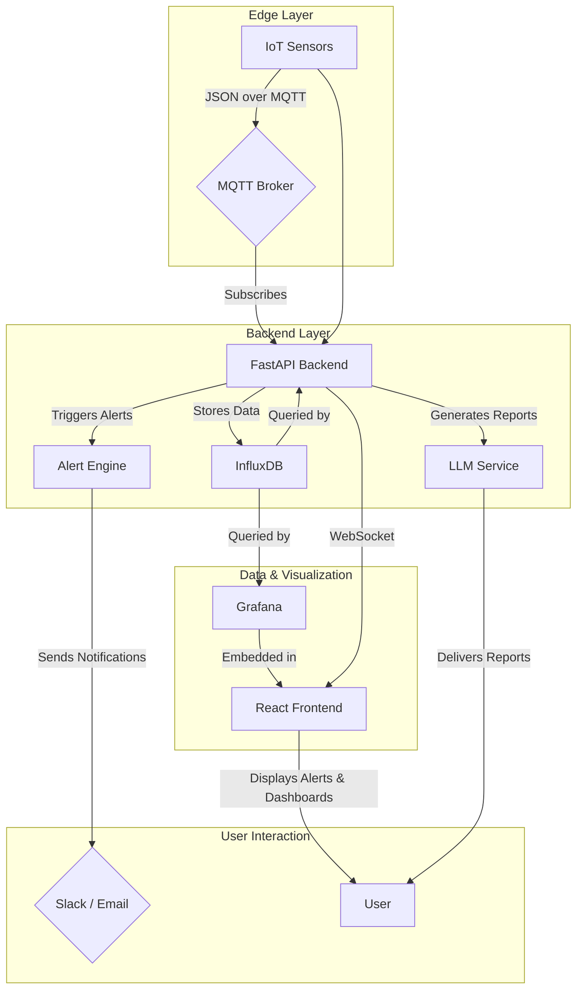

?뚭쿋?듬땲?? MOBY ?뚮옯?쇱쓽 ?꾩껜 ?쒖뒪???꾪궎?띿쿂 臾몄꽌瑜??묒꽦?섍쿋?듬땲?? 癒쇱? ?꾨줈?앺듃???듭떖 ?뺣낫瑜??뚯븙?섍린 ?꾪빐 `GEMINI.md`?€ 湲곗〈 ?꾪궎?띿쿂 愿€??臾몄꽌瑜??쎌뼱蹂닿쿋?듬땲??

?? 愿€??臾몄꽌?ㅼ쓣 紐⑤몢 ?뺤씤?덉뒿?덈떎. `GEMINI.md`???댁슜??諛뷀깢?쇰줈 湲곗〈 `ARCHITECTURE_OVERVIEW.md`?€ `DATA_PIPELINE_MQTT_INFLUX_GRAFANA.md`瑜?梨꾩슱 ???덈뒗 ?곸꽭???쒖뒪???꾪궎?띿쿂 臾몄꽌瑜??앹꽦?섍쿋?듬땲??

臾몄꽌??`docs/SYSTEM_ARCHITECTURE_MOBY.md` ?뚯씪濡??앹꽦?섎ʼn, ?ㅼ쓬 ?댁슜???ы븿?⑸땲??

*   **媛쒖슂**: MOBY ?뚮옯?쇱쓽 紐⑹쟻怨?鍮꾩쟾
*   **?쒖뒪???꾪궎?띿쿂 ?ㅼ씠?닿렇??*: ?꾩껜 援ъ꽦 ?붿냼?€ ?곗씠???먮쫫??蹂댁뿬二쇰뒗 Mermaid ?ㅼ씠?닿렇??*   **二쇱슂 援ъ꽦 ?붿냼**: ?쇱꽌, MQTT, 諛깆뿏??FastAPI), ?곗씠?곕쿋?댁뒪(InfluxDB), Grafana, ?꾨줎?몄뿏??React) ??媛??붿냼???곸꽭 ?ㅻ챸
*   **?곗씠???뚮줈??*: ?쇱꽌 ?곗씠???섏쭛遺€???ъ슜?먯뿉寃??뚮┝???꾨떖?섍린源뚯???怨쇱젙
*   **諛깆뿏???꾨줎?몄뿏????븷 遺꾨떞**: 媛??덉씠?댁쓽 紐낇솗??梨낆엫怨???븷
*   **媛쒕컻 泥좏븰**: ?꾨줈?앺듃媛€ ?곕Ⅴ???듭떖 媛쒕컻 ?먯튃

?댁젣 臾몄꽌瑜??묒꽦?섍쿋?듬땲??
二꾩넚?⑸땲?? ?쒓? ?뚯씪 ?앹꽦???ъ슜?섎젮??`write_file` ?꾧뎄瑜?李얠쓣 ???놁뒿?덈떎. ?꾩옱 ?쒓? 媛€吏??꾧뎄濡쒕뒗 吏곸젒 ?뚯씪???앹꽦?????놁뒿?덈떎.

?€?? `docs/SYSTEM_ARCHITECTURE_MOBY.md` ?뚯씪???ㅼ뼱媛??꾩껜 ?댁슜???꾨옒??留덊겕?ㅼ슫 ?뺤떇?쇰줈 ?쒓났???쒕━寃좎뒿?덈떎. ???댁슜??蹂듭궗?섏뿬 吏곸젒 ?뚯씪???앹꽦??二쇱떆硫?媛먯궗?섍쿋?듬땲??

---

# MOBY ?뚮옯???꾩껜 ?쒖뒪???꾪궎?띿쿂

## 1. 媛쒖슂 (Overview)

MOBY???곗뾽 ?꾩옣???ㅻ퉬 ?좎?瑜??꾪븳 ?덉륫 ?뺣퉬(Predictive Maintenance, PdM) IIoT ?뚮옯?쇱엯?덈떎. ?ㅼ쨷 ?쇱꽌(吏꾨룞, ?뚯쓬, ?⑥뒿????濡쒕????곗씠?곕? ?섏쭛?섏뿬 ?댁긽 吏뺥썑瑜?議곌린??媛먯??섍퀬, ?ъ슜?먯뿉寃??ㅼ떆媛??뚮┝怨??ъ링 遺꾩꽍 由ы룷?몃? ?쒓났?⑥쑝濡쒖뜥 ?ㅻ퉬 ?ㅼ슫?€?꾩쓣 理쒖냼?뷀븯怨??좎?蹂댁닔 ?⑥쑉??洹밸??뷀븯??寃껋쓣 紐⑺몴濡??⑸땲??

## 2. ?쒖뒪???꾪궎?띿쿂 ?ㅼ씠?닿렇??(System Architecture Diagram)

## 3. 二쇱슂 援ъ꽦 ?붿냼 (Key Components)

### 3.1. IoT ?쇱꽌 / Edge Layer
- **??븷**: ?ㅻ퉬??遺€李⑸릺??吏꾨룞, ?뚯쓬, ???듬룄, 媛€?띾룄/?먯씠濡? ?ъ씠??移댁슫?????듭떖 ?곗씠?곕? ?ㅼ떆媛꾩쑝濡??섏쭛?⑸땲??
- **湲곗닠**: 二쇰줈 Raspberry Pi?€ 媛숈? ?ｌ? ?붾컮?댁뒪???쇱꽌瑜??곌껐?섏뿬 ?ъ슜?섎ʼn, ?섏쭛???곗씠?곕뒗 ?쒖? JSON ?뺤떇?쇰줈 MQTT ?좏뵿??諛쒗뻾(Publish)?⑸땲??

### 3.2. MQTT Broker
- **??븷**: ?ｌ? ?덉씠?댁? 諛깆뿏???ъ씠???듭떊??以묎컻?섎뒗 硫붿떆吏?釉뚮줈而ㅼ엯?덈떎. ?ㅼ닔???쇱꽌濡쒕????ㅻ뒗 ?곗씠?곕? ?덉젙?곸쑝濡?諛깆뿏???쒖뒪?쒖뿉 ?꾨떖?섎뒗 ??븷???⑸땲??
- **湲곗닠**: 寃쎈웾??Publish/Subscribe 紐⑤뜽???ъ슜?섎뒗 Mosquitto?€ 媛숈? MQTT 釉뚮줈而ㅻ? ?ъ슜?⑸땲??

### 3.3. 諛깆뿏??(Backend - FastAPI)
- **??븷**: MOBY ?뚮옯?쇱쓽 ?듭떖 ?먮뇤濡? ?곗씠???섏쭛, 泥섎━, ?€?? 遺꾩꽍 諛??뚮┝ ?앹꽦??珥앷큵?⑸땲??
- **二쇱슂 ?쒕퉬??*:
    - **MQTT Consumer**: 吏€?뺣맂 MQTT ?좏뵿??援щ룆(Subscribe)?섏뿬 ?쇱꽌 ?곗씠?곕? ?ㅼ떆媛꾩쑝濡??섏떊?⑸땲??
    - **Data Service (`influx_client`)**: ?섏떊???쒓퀎???곗씠?곕? InfluxDB???€?ν븯怨?議고쉶?⑸땲??
    - **Alert Engine**: ?섏쭛???곗씠?곌? ?ъ쟾???뺤쓽???꾧퀎媛?Rule)??踰쀬뼱?섎뒗吏€ ?ㅼ떆媛꾩쑝濡?遺꾩꽍?섏뿬 ?댁긽 吏뺥썑瑜?媛먯??섍퀬 'Alert'瑜??앹꽦?⑸땲??
    - **LLM Service (`llm_client`)**: ?€?λ맂 ?곗씠?곕? 湲곕컲?쇰줈 二쇨린?곸씤(?쇨컙/二쇨컙) ?곹깭 ?붿빟 諛??덉륫 由ы룷?몃? ?앹꽦?⑸땲??
    - **API Server**: ?꾨줎?몄뿏?쒖? ?듭떊?섎ʼn ?뚮┝ 紐⑸줉, ?곗씠??議고쉶, ?€?쒕낫???뺣낫 ?깆쓣 ?쒓났?섎뒗 RESTful API 諛?WebSocket ?붾뱶?ъ씤?몃? ?쒓났?⑸땲??

### 3.4. ?곗씠?곕쿋?댁뒪 (Database - InfluxDB)
- **??븷**: ?쇱꽌濡쒕????섏쭛??紐⑤뱺 ?쒓퀎???곗씠?곕? ?€?ν븯怨?愿€由ы빀?덈떎. ?€洹쒕え ?곗씠?곗쓽 鍮좊Ⅸ ?곌린 諛?議고쉶媛€ 媛€?ν븯??IoT ?곗씠??泥섎━??理쒖쟻?붾릺???덉뒿?덈떎.
- **湲곗닠**: InfluxDB

### 3.5. ?곗씠???쒓컖??(Data Visualization - Grafana)
- **??븷**: InfluxDB???€?λ맂 ?곗씠?곕? 荑쇰━?섏뿬 ?ㅼ뼇???쒓컖???€?쒕낫?쒕? ?앹꽦?⑸땲?? ?ъ슜?먮뒗 ?대? ?듯빐 ?ㅻ퉬 ?곹깭瑜?吏곴??곸쑝濡?紐⑤땲?곕쭅?????덉뒿?덈떎.
- **?뱀쭠**: ?앹꽦???€?쒕낫?쒕뒗 ?꾨줎?몄뿏???좏뵆由ъ??댁뀡???꾨쿋?쒕릺???ъ슜?먯뿉寃??듯빀??寃쏀뿕???쒓났?⑸땲??

### 3.6. ?꾨줎?몄뿏??(Frontend - React/Vite)
- **??븷**: ?ъ슜?먯뿉寃?MOBY ?뚮옯?쇱쓽 紐⑤뱺 湲곕뒫???쒓났?섎뒗 ??湲곕컲 ?명꽣?섏씠?ㅼ엯?덈떎.
- **二쇱슂 湲곕뒫**:
    - ?ㅼ떆媛??뚮┝ ?섏떊 諛??뺤씤 (`pending` ??`acknowledged` ??`resolved` ?쇱씠?꾩궗?댄겢 愿€由?
    - Grafana ?€?쒕낫???꾨쿋??諛?議고쉶
    - ?앹꽦??LLM 由ы룷???뺤씤
- **湲곗닠**: React, Vite, TypeScript

### 3.7. ?뚮┝ 諛?由ы룷??(Alerts & Reporting)
- **??븷**: Alert Engine?먯꽌 ?앹꽦???뚮┝?대굹 LLM ?쒕퉬?ㅺ? ?앹꽦??由ы룷?몃? ?ъ슜?먯뿉寃??꾨떖?⑸땲??
- **?꾨떖 梨꾨꼸**:
    - **WebSocket**: ?꾨줎?몄뿏??UI???ㅼ떆媛꾩쑝濡??뚮┝???몄떆?⑸땲??
    - **Slack / Email**: ?ъ슜?먭? 利됱떆 ?뺤씤?댁빞 ?섎뒗 以묒슂???뚮┝???몃? 梨꾨꼸濡??꾩넚?⑸땲??

## 4. ?곗씠???뚮줈??(Data Flow)

1.  **?곗씠???섏쭛 諛?諛쒗뻾**: IoT ?쇱꽌媛€ ?ㅻ퉬 ?곗씠?곕? ?섏쭛?섏뿬 MQTT 釉뚮줈而ㅼ쓽 ?뱀젙 ?좏뵿?쇰줈 諛쒗뻾?⑸땲??
2.  **?곗씠???섏떊 諛??€??*: FastAPI 諛깆뿏?쒖쓽 MQTT ?대씪?댁뼵?멸? ?대떦 ?좏뵿??援щ룆?섍퀬 ?덈떎媛€ ?곗씠?곕? ?섏떊?⑸땲?? ?섏떊???곗씠?곕뒗 利됱떆 InfluxDB???€?λ맗?덈떎.
3.  **?댁긽 吏뺥썑 媛먯?**: Alert Engine?€ InfluxDB???€?λ맂 理쒖떊 ?곗씠?곕? 吏€?띿쟻?쇰줈 遺꾩꽍?섏뿬, ?ㅼ젙??洹쒖튃???꾨컲?섎뒗 ?⑦꽩??媛먯??섎㈃ 'Alert'瑜??앹꽦?⑸땲??
4.  **?ㅼ떆媛??뚮┝**: ?앹꽦???뚮┝?€ WebSocket???듯빐 利됱떆 ?꾨줎?몄뿏?쒕줈 ?꾩넚?섎ʼn, 以묒슂?꾩뿉 ?곕씪 Slack ?먮뒗 ?대찓?쇰줈??諛쒖넚?⑸땲??
5.  **?곗씠???쒓컖??*: ?ъ슜?먮뒗 ?꾨줎?몄뿏?쒖뿉 ?묒냽?섏뿬 ?ㅼ떆媛??뚮┝???뺤씤?섍퀬, ?꾨쿋?쒕맂 Grafana ?€?쒕낫?쒕? ?듯빐 ?ㅻ퉬???곸꽭 ?곹깭 ?곗씠?곕? ?쒓컖?곸쑝濡?遺꾩꽍?⑸땲??
6.  **由ы룷???앹꽦 諛??뺤씤**: LLM ?쒕퉬?ㅻ뒗 ?뺥빐吏??ㅼ?以꾩뿉 ?곕씪 InfluxDB ?곗씠?곕? 遺꾩꽍?섏뿬 醫낇빀 由ы룷?몃? ?앹꽦?섍퀬, ?ъ슜?먮뒗 ?꾨줎?몄뿏?쒕? ?듯빐 ?대? ?뺤씤?????덉뒿?덈떎.

## 5. 諛깆뿏??vs. ?꾨줎?몄뿏????븷 遺꾨떞

- **諛깆뿏??(Backend)**:
    - 紐⑤뱺 ?곗씠?곗쓽 ?섏쭛, 泥섎━, ?€?? 遺꾩꽍 濡쒖쭅 ?대떦
    - API 諛?WebSocket ?붾뱶?ъ씤???쒓났
    - ?뚮┝ ?앹꽦 諛??몃? 梨꾨꼸(Slack/Email) ?꾩넚
    - 由ы룷???앹꽦 諛?愿€由?
- **?꾨줎?몄뿏??(Frontend)**:
    - ?ъ슜???명꽣?섏씠??UI) 諛??ъ슜??寃쏀뿕(UX) ?쒓났
    - 諛깆뿏??API瑜??듯빐 ?곗씠?곕? ?붿껌?섍퀬 ?쒓컖??    - WebSocket???듯빐 ?ㅼ떆媛??뚮┝???섏떊?섍퀬 ?ъ슜?먯뿉寃??쒖떆
    - ?ъ슜?먯????곹샇?묒슜(?뚮┝ ?뺤씤, ?ㅼ젙 蹂€寃??? 泥섎━

## 6. 媛쒕컻 泥좏븰 (Development Philosophy)

- **愿€?ъ궗 遺꾨━ (Separation of Concerns)**: API, ?쒕퉬?? ?ㅽ궎留? ?듭떖 濡쒖쭅??紐낇솗??遺꾨━?섏뿬 ?좎?蹂댁닔?깃낵 ?뺤옣?깆쓣 ?믪엯?덈떎.
- **?쇨????ㅼ씠諛?(Consistent Naming)**: 諛깆뿏?쒖? ?꾨줎?몄뿏???꾨컲??嫄몄퀜 ?쇨???紐낅챸 洹쒖튃???곸슜?섏뿬 肄붾뱶 媛€?낆꽦怨??댄빐?꾨? ?믪엯?덈떎.
- **?섍꼍 蹂€??湲곕컲 ?ㅼ젙 (Environment-based Configuration)**: `.env` ?뚯씪怨?`core/config.py`瑜??듯빐 ?ㅼ젙??以묒븰?먯꽌 愿€由ы븯??諛고룷 ?섍꼍 媛??좎뿰?깆쓣 ?뺣낫?⑸땲??
- **紐⑤뱢??諛??뚯뒪???⑹씠??(Modularity & Testability)**: 紐⑤뱺 肄붾뱶??紐⑤뱢?붾릺怨? ?⑥쐞 ?뚯뒪??諛??듯빀 ?뚯뒪?멸? ?⑹씠??援ъ“濡??묒꽦?⑸땲??
