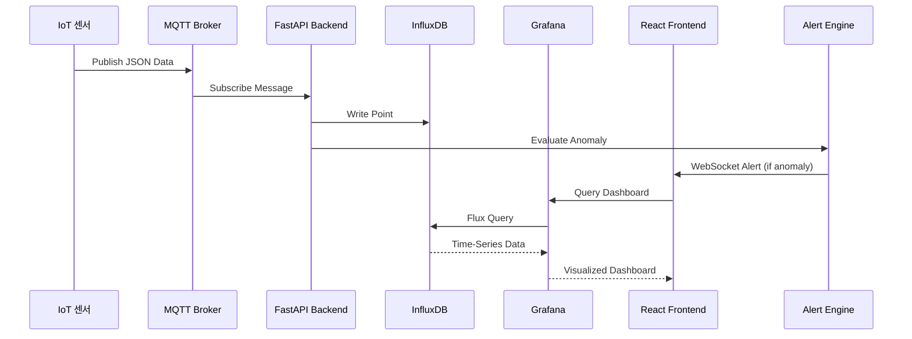

# 센서 → MQTT → FastAPI → InfluxDB → Grafana 데이터 파이프라인

> MOBY 플랫폼의 데이터 수집, 저장, 시각화 파이프라인에 대한 상세 설명 문서입니다.

---

## 1. 고수준 데이터 흐름 요약

MOBY 플랫폼의 데이터 파이프라인은 다음과 같은 단계로 구성되어 있습니다:

```
IoT 센서 (Edge Layer)
  ↓ [JSON over MQTT]
MQTT Broker (Mosquitto)
  ↓ [Subscribe]
FastAPI Backend (routes_sensors.py)
  ↓ [데이터 저장]
InfluxDB (Time-Series DB)
  ↓ [Query]
Grafana (Visualization)
  ↓ [Embed in React]
React 프론트엔드 (Alert UI)
```

### 핵심 특징

- **실시간 데이터 스트리밍**: MQTT를 통한 실시간 센서 데이터 전송
- **시계열 최적화**: InfluxDB를 통한 효율적인 시계열 데이터 저장 및 쿼리
- **대화형 시각화**: Grafana 대시보드를 React 프론트엔드에 임베드
- **자동 이상 탐지**: FastAPI 백엔드에서 실시간 이상 탐지 및 알람 생성

---

## 2. 각 단계 상세 설명

### 2.1 Edge Layer (IoT 센서)

**역할**: 공장 현장에 설치된 IoT 센서에서 실시간 데이터 수집

**센서 타입**:
- 온도/습도 센서 (`temperature`, `humidity`)
- 진동 센서 (`vibration`)
- 소리 센서 (`sound`)
- 가속도계/자이로 (`accel`, `gyro`)
- 사이클 카운터 (`cycle_count`)

**데이터 형식**:
```json
{
  "device_id": "sensor_001",
  "temperature": 25.3,
  "humidity": 60.5,
  "vibration": 0.12,
  "sound": 45.8,
  "timestamp": "2025-11-17T10:30:00Z"
}
```

**구현**: Raspberry Pi 또는 유사한 엣지 디바이스에서 Python 스크립트로 센서 데이터를 읽어 MQTT 브로커로 발행

---

### 2.2 MQTT Broker (Mosquitto)

**역할**: 센서와 백엔드 간의 메시지 브로커 역할

**주요 기능**:
- **Pub/Sub 패턴**: 센서는 Publisher, FastAPI는 Subscriber
- **토픽 구조**: `factory/sensor/data` (예시)
- **QoS 레벨**: 데이터 손실 방지를 위한 품질 보장

**설정 위치**:
- `backend/api/services/schemas/models/core/config.py`에서 MQTT 호스트/포트 설정
- 기본값: `localhost:1883`

**현재 구현**:
- `backend/api/services/mqtt_client.py`: MQTT 메시지 발행 함수 제공
- `publish_message(topic: str, payload: dict)`: 토픽에 JSON 메시지 발행

---

### 2.3 FastAPI Backend (Data Consumer)

**역할**: MQTT에서 메시지를 구독하고, 데이터를 처리 및 저장하는 백엔드

**주요 구성 요소**:

#### 2.3.1 API 라우터 (`routes_sensors.py`)
- **엔드포인트**: `POST /publish`
- **기능**: 센서 데이터를 받아 MQTT 브로커로 발행
- **스키마**: `SensorData` (device_id, temperature, humidity, vibration, sound)

#### 2.3.2 데이터 저장 (`influx_client.py`)
- **역할**: 시계열 데이터를 InfluxDB에 기록
- **함수**: `write_point(bucket: str, measurement: str, fields: dict, tags: dict)`
- **데이터 구조**:
  - **Fields**: 측정값 (temperature, humidity, vibration 등)
  - **Tags**: 메타데이터 (device_id, location 등)

#### 2.3.3 이상 탐지 (`alert_engine.py`)
- **역할**: 센서 데이터 벡터를 분석하여 이상 여부 판단
- **프로세스**:
  1. 센서 데이터를 벡터로 변환
  2. L2 norm 계산 (`anomaly_vector_service`)
  3. 임계값 기준 이상 여부 판단
  4. 이상 시 알람 페이로드 생성
  5. LLM 요약 생성 (옵션)

---

### 2.4 InfluxDB (Time-Series Database)

**역할**: 시계열 데이터의 효율적인 저장 및 쿼리

**주요 특징**:
- **버킷 구조**: 데이터를 버킷 단위로 조직
- **측정(Measurement)**: 센서 타입별로 측정 단위 정의
- **쿼리 언어**: Flux 쿼리 언어 사용
- **보존 정책**: 자동 데이터 보존 기간 관리

**설정**:
- URL: `http://localhost:8086` (기본값)
- 토큰: 인증 토큰 (`settings.INFLUX_TOKEN`)
- 조직: 조직 이름 (`settings.INFLUX_ORG`)

**데이터 구조 예시**:
```
Bucket: factory_sensors
Measurement: temperature
Tags: {device_id: "sensor_001", location: "factory_a"}
Fields: {value: 25.3}
Timestamp: 2025-11-17T10:30:00Z
```

---

### 2.5 Grafana (Data Visualization)

**역할**: InfluxDB 데이터를 시각화하는 대시보드

**주요 기능**:
- **패널 생성**: 센서별 시계열 그래프
- **임계값 표시**: Reference Line을 통한 경고/심각 임계값 표시
- **대시보드 임베드**: React 프론트엔드에 Grafana 대시보드 임베드

**패널 구성 예시**:
- 온도/습도 패널
- 진동 패널
- 소리 패널
- 이상 탐지 알람 패널

**React 연동**:
- Grafana 대시보드를 iframe으로 임베드
- 사용자는 웹 브라우저에서 실시간 데이터 모니터링

---

### 2.6 React Frontend (Alert UI)

**역할**: 사용자 인터페이스 및 실시간 알람 표시

**주요 기능**:
- **Grafana 대시보드 임베드**: 시각화된 데이터 표시
- **WebSocket 클라이언트**: 실시간 알람 수신
- **Alert UI**: 토스트 알람 및 알람 패널 표시
- **알람 라이프사이클**: `pending → acknowledged → resolved` 상태 관리

---

## 3. 데이터 흐름 다이어그램



---

## 4. 장애/이상 상황 대응

### 4.1 MQTT Broker 장애

**문제점**:
- 센서 데이터가 백엔드로 전달되지 않음
- 실시간 모니터링 중단

**대응 방안**:
- MQTT 클라이언트 재연결 로직 구현 (exponential backoff)
- 연결 상태 모니터링 및 알람
- 메시지 버퍼링 (센서 측에서 임시 저장 후 재전송)

### 4.2 InfluxDB 장애

**문제점**:
- 시계열 데이터 저장 실패
- Grafana 대시보드 데이터 부재

**대응 방안**:
- InfluxDB 쓰기 실패 시 로깅 및 알람
- 임시 데이터 버퍼링 (메모리 또는 로컬 파일)
- 복구 시 버퍼된 데이터 재전송
- InfluxDB 헬스체크 엔드포인트 구현

### 4.3 FastAPI 백엔드 장애

**문제점**:
- MQTT 메시지 처리 중단
- 알람 생성 중단
- API 엔드포인트 응답 불가

**대응 방안**:
- 백엔드 헬스체크 엔드포인트 (`/health`)
- 자동 재시작 메커니즘 (Docker, systemd 등)
- 로깅을 통한 장애 원인 추적
- 모니터링 도구 통합 (Prometheus, Grafana 등)

### 4.4 네트워크 장애

**문제점**:
- 센서와 MQTT 브로커 간 연결 끊김
- 백엔드와 InfluxDB 간 연결 끊김

**대응 방안**:
- 네트워크 재연결 로직 구현
- 타임아웃 설정 및 재시도 정책
- 네트워크 상태 모니터링

### 4.5 데이터 손실 방지

**전략**:
- **MQTT QoS 레벨**: 메시지 전달 보장을 위한 QoS 1 또는 2 사용
- **InfluxDB 배치 쓰기**: 여러 포인트를 묶어서 쓰기 (성능 및 안정성 향상)
- **에러 로깅**: 모든 장애 상황을 상세히 로깅하여 추후 분석

---

## 5. 성능 최적화 고려사항

### 5.1 데이터 처리 최적화

- **배치 처리**: 여러 센서 데이터를 묶어서 InfluxDB에 쓰기
- **비동기 처리**: FastAPI의 async/await 활용하여 동시성 향상
- **데이터 압축**: MQTT 메시지 압축 (필요 시)

### 5.2 InfluxDB 최적화

- **보존 정책**: 오래된 데이터 자동 삭제
- **인덱싱**: 태그 기반 인덱싱 활용
- **쿼리 최적화**: Flux 쿼리 최적화로 대시보드 로딩 시간 단축

### 5.3 Grafana 최적화

- **데이터 범위 제한**: 쿼리 시간 범위를 적절히 설정
- **패널 최적화**: 필요한 데이터만 쿼리
- **캐싱**: 자주 사용하는 쿼리 결과 캐싱

---

## 6. 향후 개선 사항

- [ ] MQTT 메시지 큐잉 및 재시도 로직 구현
- [ ] InfluxDB 쓰기 배치 처리 최적화
- [ ] 데이터 파이프라인 헬스체크 엔드포인트 구현
- [ ] 장애 시 자동 복구 메커니즘
- [ ] 데이터 파이프라인 모니터링 대시보드 구축
- [ ] 로드 밸런싱 및 고가용성 구성

---

**문서 최종 업데이트**: 2025-11-17
