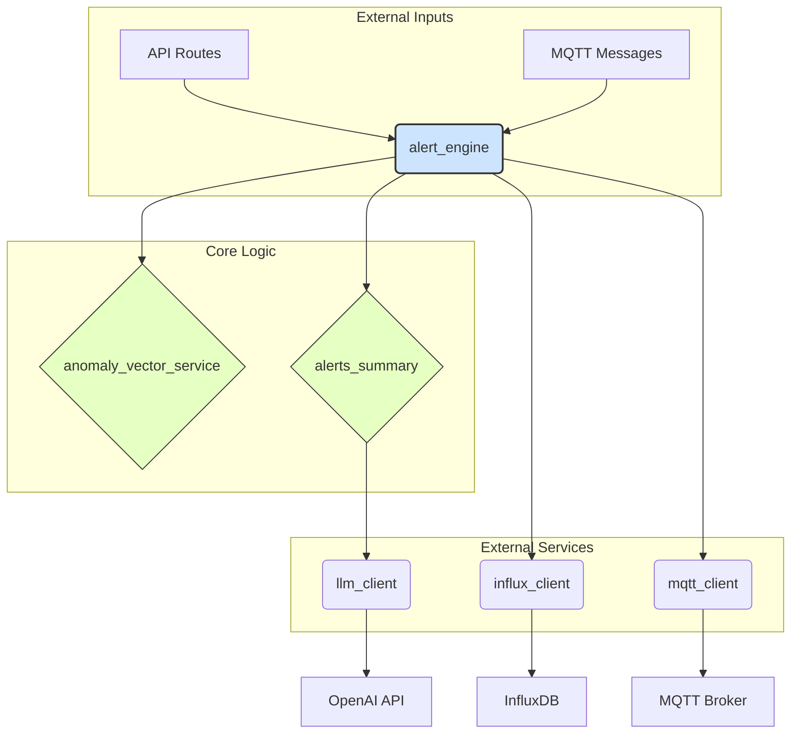

Loaded cached credentials.

# MOBY 諛깆뿏???쒕퉬??遺꾩꽍 諛?媛쒖꽑 ?쒖븞

## 1. `backend/api/services` ?꾩껜 援ъ“

`backend/api/services` ?붾젆?곕━??MOBY ?뚮옯??諛깆뿏???쒖뒪?쒖쓽 ?듭떖 鍮꾩쫰?덉뒪 濡쒖쭅???대떦?섎뒗 ?쒕퉬??紐⑤뱢?ㅼ쓣 ?ы븿?⑸땲?? 媛??쒕퉬?ㅻ뒗 ?뱀젙 ?꾨찓??湲곕뒫(?뚮┝ ?됯?, ?댁긽 ?먯?, ?곗씠?곕쿋?댁뒪 ?듭떊, LLM ?곕룞 ????罹≪뒓?뷀븯??紐낇솗????븷 遺꾨떞怨??ъ궗?⑹꽦??吏€?ν빀?덈떎.

### ?쒕퉬??媛??곹샇?묒슜 ?먮쫫



- **`alert_engine`**??而⑦듃濡??€????븷???섎ʼn, ?몃?濡쒕????뚮┝ ?됯? ?붿껌??諛쏆뒿?덈떎.
- `alert_engine`?€ **`anomaly_vector_service`**瑜??몄텧?섏뿬 踰≫꽣 ?곗씠?곗쓽 ?댁긽 ?먯닔(norm)?€ ?ш컖?꾨? 怨꾩궛?⑸땲??
- ?댁긽??媛먯??섎㈃, **`alerts_summary`** ?쒕퉬?ㅻ? ?듯빐 **`llm_client`**瑜??몄텧?섏뿬 AI 湲곕컲???곹솴 ?붿빟???앹꽦?????덉뒿?덈떎.
- 理쒖쥌 ?뚮┝ ?섏씠濡쒕뱶??**`influx_client`**瑜??듯빐 ?쒓퀎???곗씠?곕쿋?댁뒪(InfluxDB)???€?λ릺嫄곕굹, **`mqtt_client`**瑜??듯빐 ?ㅻⅨ ?쒖뒪?쒖쑝濡??꾪뙆?????덉뒿?덈떎.

---

## 2. 媛쒕퀎 ?쒕퉬????븷 諛?媛쒖꽑 ?ъ씤??
### 2.1. `constants.py`

- **??븷**: ?쒖뒪???꾨컲?먯꽌 ?ъ슜?섎뒗 ?곸닔(Enum, 湲곕낯媛? 硫붿떆吏€ ??瑜?以묒븰?먯꽌 愿€由ы빀?덈떎.
- **遺꾩꽍**: ?곸닔瑜?遺꾨━?섏뿬 愿€由ы븯??寃껋? 肄붾뱶???쇨??깃낵 ?좎?蹂댁닔?깆쓣 ?믪씠??醫뗭? ?⑦꽩?낅땲?? `Severity`?€ `AlertLevel` 媛숈? Enum???ъ슜?섏뿬 留ㅼ쭅 ?ㅽ듃留곸쓣 諛⑹??섍퀬 肄붾뱶??媛€?낆꽦???믪??듬땲??
- **媛쒖꽑 ?ъ씤??*:
  - **(?꾩긽???좎?)** ?꾩옱 援ъ“??留ㅼ슦 ?⑥쑉?곸씠硫?異붽??곸씤 媛쒖꽑?€ 遺덊븘?뷀빀?덈떎.

### 2.2. `anomaly_vector_service.py`

- **??븷**: ?쒖닔 怨꾩궛 濡쒖쭅???대떦?⑸땲?? 踰≫꽣(List[float])瑜??낅젰諛쏆븘 L2 Norm(?좏겢由щ뱶 嫄곕━)??怨꾩궛?섍퀬, 二쇱뼱吏??꾧퀎媛?Threshold)怨?鍮꾧탳?섏뿬 ?댁긽 ?щ? 諛??ш컖?꾨? ?먮떒?⑸땲??
- **遺꾩꽍**: ?섑븰??怨꾩궛怨??먮떒 濡쒖쭅??蹂꾨룄 ?쒕퉬?ㅻ줈 遺꾨━?섏뿬 ?⑥쐞 ?뚯뒪?멸? ?⑹씠?섍퀬 ?ъ궗?⑹꽦???믪뒿?덈떎. ?낅젰媛믪뿉 ?€??`ValueError` ?덉쇅 泥섎━媛€ ???섏뼱 ?덉뒿?덈떎.
- **媛쒖꽑 ?ъ씤??*:
  - **誘몄궗???⑥닔 ?뺣━**: `calculate_vector_norm_squared` ?⑥닔???쒓낢洹?怨꾩궛(`math.sqrt`)???앸왂?섏뿬 ?깅뒫???댁젏??媛€吏????덉?留? ?꾩옱 `alert_engine`?먯꽌 ?ъ슜?섏? ?딄퀬 ?덉뒿?덈떎. ?꾧퀎媛???떆 ?쒓낢??媛믨낵 鍮꾧탳?섎룄濡?`alert_engine`???섏젙?섍굅?? 誘몄궗???⑥닔瑜??쒓굅?섏뿬 肄붾뱶 蹂듭옟?깆쓣 以꾩씠??寃껋쓣 沅뚯옣?⑸땲??

### 2.3. `llm_client.py`

- **??븷**: OpenAI API?€ ?듭떊?섏뿬 LLM(?€洹쒕え ?몄뼱 紐⑤뜽) 湲곕뒫???쒓났?⑸땲?? ?꾩옱???뚮┝ ?곗씠???붿빟(`summarize_alert`) 湲곕뒫???ъ슜?⑸땲??
- **遺꾩꽍**: OpenAI ?대씪?댁뼵??珥덇린??諛??몄텧 濡쒖쭅??媛꾨떒?섍쾶 援ы쁽?섏뼱 ?덉뒿?덈떎.
- **媛쒖꽑 ?ъ씤??*:
  - **?ㅼ젙 ?몃???*: `model="gpt-4o-mini"` ?€ 媛숈씠 ?섎뱶肄붾뵫??紐⑤뜽紐낆쓣 `core/config.py`???섍꼍 蹂€?섎줈 ?대룞?쒖폒 ?좎뿰?깆쓣 ?뺣낫?댁빞 ?⑸땲??
  - **?꾨＼?꾪듃 ?붿??덉뼱留?*: `f"Summarize this alert: {data}"` ?뺥깭???⑥닚???꾨＼?꾪듃??LLM???깅뒫???꾩쟾???쒖슜?섍린 ?대졄?듬땲?? JSON ?곗씠?곗쓽 二쇱슂 ?꾨뱶瑜??ㅻ챸?섍퀬 ?먰븯??異쒕젰 ?뺤떇??紐낆떆?섎뒗 ??援ъ“?붾맂 ?꾨＼?꾪듃瑜??ъ슜?섏뿬 ?붿빟???덉쭏怨??쇨??깆쓣 ?믪뿬???⑸땲??
  - **?먮윭 ?몃뱾留?*: `openai.APIError` ???ㅽ듃?뚰겕 ?ㅻ쪟??API ???ㅻ쪟 諛쒖깮 ?쒕? ?€鍮꾪븳 `try-except` 釉붾줉怨?濡쒓퉭???꾩슂?⑸땲??
  - **?대씪?댁뼵???앸챸二쇨린 愿€由?*: ?꾩옱 ?대씪?댁뼵?멸? 紐⑤뱢 ?덈꺼?먯꽌 珥덇린?붾맗?덈떎. FastAPI ?좏뵆由ъ??댁뀡???앸챸二쇨린?€ ?곕룞?섏뿬 (?? `startup` ?대깽???몃뱾?? Dependency Injection) ?대씪?댁뼵???곌껐??愿€由ы븯??寃껋씠 ???덉젙?곸엯?덈떎.

### 2.4. `influx_client.py`

- **??븷**: InfluxDB ?쒓퀎???곗씠?곕쿋?댁뒪???곗씠?곕? ?곕뒗(Write) 湲곕뒫???대떦?⑸땲??
- **遺꾩꽍**: `influxdb-client` ?쇱씠釉뚮윭由щ? ?ъ슜?섏뿬 InfluxDB?€ ?곕룞?⑸땲?? ?ㅼ젙?€ `core.config`?먯꽌 媛€?몄? ??遺꾨━?섏뼱 ?덉뒿?덈떎.
- **媛쒖꽑 ?ъ씤??*:
  - **API ?ъ슜 理쒖쟻??*: `write_point` ?⑥닔 ?댁뿉??留ㅻ쾲 `client.write_api()`瑜??몄텧?섎뒗 寃껋? 鍮꾪슚?⑥쟻?낅땲?? `WriteApi` 媛앹껜????踰??앹꽦 ???ъ궗?⑺븯??寃껋씠 沅뚯옣?⑸땲?? ?좏뵆由ъ??댁뀡 ?ㅼ퐫?꾩뿉??`write_api`瑜?愿€由ы븯嫄곕굹, 理쒖냼???⑥닔 諛뽰뿉??珥덇린?뷀븯???ъ슜?댁빞 ?⑸땲??
    ```python
    # 媛쒖꽑 ?덉떆
    write_api = client.write_api()
    def write_point(bucket: str, ...):
        # ...
        write_api.write(bucket=bucket, record=p)
    ```
  - **?먮윭 ?몃뱾留?*: ?곗씠?곕쿋?댁뒪 ?곌린 ?ㅽ뙣 ??諛쒖깮?????덈뒗 ?덉쇅(e.g., `InfluxDBError`)???€??泥섎━媛€ ?꾩슂?⑸땲??

### 2.5. `mqtt_client.py`

- **??븷**: MQTT 釉뚮줈而ㅼ뿉 硫붿떆吏€瑜?諛쒗뻾(Publish)?섎뒗 湲곕뒫???섑뻾?⑸땲??
- **遺꾩꽍**: `paho-mqtt` ?쇱씠釉뚮윭由щ? ?ъ슜?섎ʼn, 湲곕낯?곸씤 諛쒗뻾 湲곕뒫??援ы쁽?섏뼱 ?덉뒿?덈떎.
- **媛쒖꽑 ?ъ씤??*:
  - **(?ш컖) 鍮꾪슚?⑥쟻???곌껐 愿€由?*: `publish_message` ?⑥닔 ?몄텧 ?쒕쭏??`connect`?€ `disconnect`瑜?諛섎났?섎뒗 寃껋? **留ㅼ슦 ?ш컖???깅뒫 ?€??*瑜??좊컻?⑸땲?? MQTT ?대씪?댁뼵?몃뒗 ??踰??곌껐??留브퀬, ?좏뵆由ъ??댁뀡???ㅽ뻾?섎뒗 ?숈븞 ?곌껐???좎??댁빞 ?⑸땲?? FastAPI???앸챸二쇨린 ?대깽?몃굹 蹂꾨룄??諛깃렇?쇱슫???꾨줈?몄뒪瑜??듯빐 ?곌껐??愿€由ы빐???⑸땲??
  - **?곗씠??吏곷젹??*: `str(payload)`濡??섏씠濡쒕뱶瑜?臾몄옄?댄솕?섎뒗 諛⑹떇?€ 遺덉븞?뺥빀?덈떎. ?섏떊 痢≪뿉???곗씠?곕? ?뚯떛?섍린 ?대졄湲??뚮Ц?낅땲?? `json.dumps(payload)`瑜??ъ슜?섏뿬 ?쒖??곸씤 JSON ?뺤떇?쇰줈 吏곷젹?뷀븯??寃껋씠 諛붾엺吏곹빀?덈떎.
  - **?먮윭 ?몃뱾留?*: `connect` ?ㅽ뙣??`publish` ?ㅽ뙣 ?쒖쓽 ?덉쇅 泥섎━媛€ 諛섎뱶??異붽??섏뼱???⑸땲??

### 2.6. `alerts_summary.py`

- **??븷**: `alert_engine`怨?`llm_client` ?ъ씠??釉뚮┸吏€ ??븷???⑸땲?? ?뚮┝ ?곗씠?곗뿉 ?€???붿빟 ?앹꽦???대떦?⑸땲??
- **遺꾩꽍**: LLM ?붿빟 濡쒖쭅??`alert_engine`?먯꽌 遺꾨━?섏뿬 ?⑥씪 梨낆엫 ?먯튃??以€?섑빀?덈떎.
- **媛쒖꽑 ?ъ씤??*:
  - **濡쒓퉭**: `TODO` 二쇱꽍??紐낆떆???€濡? `print` 臾몄쓣 `logging` 紐⑤뱢???ъ슜???쒖? 濡쒓퉭?쇰줈 援먯껜?댁빞 ?⑸땲??
  - **諛곗튂 泥섎━ 鍮꾪슚??*: `generate_summary_batch` ?⑥닔???⑥닚??`for` 猷⑦봽瑜??뚮ʼn LLM API瑜??쒖감?곸쑝濡??몄텧?⑸땲?? ?대뒗 留ㅼ슦 ?먮┰?덈떎. `asyncio.gather` ?깆쓣 ?ъ슜?섏뿬 API ?몄텧??蹂묐젹濡?泥섎━?섎㈃ ?깅뒫???ш쾶 ?μ긽?쒗궗 ???덉뒿?덈떎.

### 2.7. `alert_engine.py`

- **??븷**: ?뚮┝ 泥섎━???듭떖 ?ㅼ??ㅽ듃?덉씠???쒕퉬?ㅼ엯?덈떎. ?낅젰 ?곗씠??寃€利? ?댁긽 ?됯?, LLM ?붿빟 ?몄텧, 理쒖쥌 ?뚮┝ ?섏씠濡쒕뱶 ?앹꽦??珥앷큵?⑸땲??
- **遺꾩꽍**: Pydantic 紐⑤뜽(`AlertInputModel`, `AlertPayloadModel`)???쒖슜???낅젰 ?곗씠??寃€利?諛?異쒕젰 援ъ“ ?뺤쓽??留ㅼ슦 ?뚮??⑸땲?? 肄붾뱶???덉젙?깃낵 紐낇솗?깆쓣 ?ш쾶 ?믪뿬以띾땲?? 濡쒖쭅???먮쫫??紐낇솗?섍퀬, 媛??④퀎蹂꾨줈 ?덉쇅 泥섎━媛€ ???섏뼱 ?덉뒿?덈떎.
- **媛쒖꽑 ?ъ씤??*:
  - **ID ?앹꽦 ?꾨왂**: ?뚮┝ ID瑜?`f"anomaly-{_now_iso()}"`濡??앹꽦?섎뒗 諛⑹떇?€ 珥덈떦 ?섎갚 嫄??댁긽???대깽?멸? 諛쒖깮??寃쎌슦 異⑸룎 媛€?μ꽦???덉뒿?덈떎. ???믪? 泥섎━?됱씠 ?덉긽?쒕떎硫?`uuid.uuid4()`?€ 媛숈? 踰붿슜 怨좎쑀 ?앸퀎?먮? ?ъ슜?섎뒗 寃껋씠 ???덉쟾?⑸땲??
  - **LLM ?붿빟 ?ㅽ뙣 泥섎━**: LLM ?붿빟 ?앹꽦 ?ㅽ뙣 ??`llm_summary` ?꾨뱶媛€ `None`?쇰줈 ?④쾶 ?⑸땲?? ?대뒗 ?섎룄???숈옉?????덉쑝?? ?ㅽ뙣?덈떎???ъ떎??`meta` ?꾨뱶 ?깆뿉 湲곕줉?대몢硫?異뷀썑 ?붾쾭源낆뿉 ?좎슜?????덉뒿?덈떎. (?? `meta: {"llm_summary_failed": True}`)

---

## 3. 醫낇빀 ?쒖븞

1.  **MQTT 諛?InfluxDB ?대씪?댁뼵??由ы뙥?좊쭅 (?곗꽑?쒖쐞: ?믪쓬)**: `mqtt_client`??鍮꾪슚?⑥쟻???곌껐 愿€由щ뒗 利됱떆 ?섏젙?섏뼱???⑸땲?? ???대씪?댁뼵??紐⑤몢 ?좏뵆由ъ??댁뀡 ?앸챸二쇨린??留욎떠 ?곌껐??愿€由ы븯怨? API ?ъ슜踰뺤쓣 理쒖쟻?뷀빐???⑸땲??
2.  **LLM ?곕룞 媛뺥솕 (?곗꽑?쒖쐞: 以묎컙)**: `llm_client`???꾨＼?꾪듃瑜?怨좊룄?뷀븯怨? 紐⑤뜽紐??깆쓽 ?ㅼ젙???몃??뷀븯???좎뿰?깆쓣 ?뺣낫?댁빞 ?⑸땲?? `alerts_summary`??諛곗튂 泥섎━ 濡쒖쭅?€ 蹂묐젹 泥섎━濡??깅뒫??媛쒖꽑?댁빞 ?⑸땲??
3.  **?꾨컲?곸씤 ?먮윭 ?몃뱾留?諛?濡쒓퉭 ?듭씪 (?곗꽑?쒖쐞: 以묎컙)**: 紐⑤뱺 ?쒕퉬?ㅼ뿉??`print` ?€???쒖? `logging` 紐⑤뱢???ъ슜?섍퀬, ?몃? ?쒕퉬??API, DB) ?몄텧 ??諛쒖깮 媛€?ν븳 ?덉쇅瑜?紐낆떆?곸쑝濡?泥섎━?섏뿬 ?쒖뒪???덉젙?깆쓣 ?믪뿬???⑸땲??
4.  **肄붾뱶 ?뺣━ (?곗꽑?쒖쐞: ??쓬)**: `anomaly_vector_service`??誘몄궗???⑥닔瑜??뺣━?섎뒗 ??肄붾뱶踰좎씠?ㅻ? 源붾걫?섍쾶 ?좎??⑸땲??
